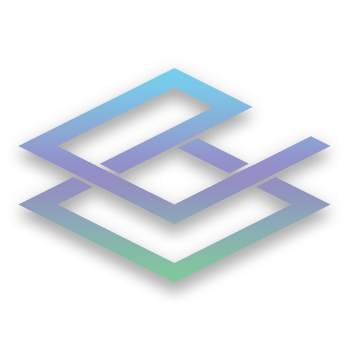

# DayDBot
<div id="top"></div>
<!-- NOTEs: -->

<!-- PROJECT SHIELDS -->
<!--
*** I'm using markdown "reference style" links for readability.
*** Reference links are enclosed in brackets [ ] instead of parentheses ( ).
*** See the bottom of this document for the declaration of the reference variables
*** for contributors-url, forks-url, etc. This is an optional, concise syntax you may use.
*** https://www.markdownguide.org/basic-syntax/#reference-style-links
-->

<!-- 
https://discord.com/api/oauth2/authorize?client_id=899692688637558857&permissions=1505319185654&redirect_uri=https%3A%2F%2Fdiscord.events.stdlib.com%2Fdiscord%2Fauth%2F&response_type=code&scope=identify%20connections%20messages.read%20bot%20applications.commands%20guilds
Discord Bot Scopes
identify
bot
applications.commands
connections
messages.read
guilds
-->


[![Contributors][contributors-shield]][contributors-url]
[![Forks][forks-shield]][forks-url]
[![Stargazers][stars-shield]][stars-url]
[![Issues][issues-shield]][issues-url]
[![License: GPL v3][license-shield]][license-url]

<!-- PROJECT LOGO -->
<br />
<div align="center">
  <a href="https://github.com/skullgaming31/DayD">
    
  </a>

<h3 align="center">DayD Discord & killfeed Bot</h3>

  <p align="center">
    DayD Discord & killfeed Bot<br>
    ·
    All Killfeed code belongs to OFFSETSYNT4X as i used his admin command for the killfeed, check out Acknowledgments for a link to the Original Repository<
    <a href="https://github.com/skullgaming31/DayD/issues">Report Bug</a>
    ·
    <a href="https://github.com/skullgaming31/DayD/issues">Request Feature</a>
  </p>
</div>

<!-- TABLE OF CONTENTS -->
<details>
  <summary>Table of Contents</summary>
  <ol>
    <li>
      <a href="#about-the-project">About The Project</a>
      <ul>
        <li><a href="#built-with">Built With</a></li>
      </ul>
    </li>
    <li>
      <a href="#getting-started">Getting Started</a>
      <ul>
        <li><a href="#prerequisites">Prerequisites</a></li>
        <li><a href="#installation">Installation</a></li>
      </ul>
    </li>
    <!-- <li><a href="#usage">Usage</a></li> -->
    <li><a href="#roadmap">Roadmap</a></li>
    <li><a href="#contributing">Contributing</a></li>
    <li><a href="#license">License</a></li>
    <li><a href="#contact">Contact</a></li>
    <li><a href="#acknowledgments">Acknowledgments</a></li>
  </ol>
</details>

<!-- ABOUT THE PROJECT -->
## About The Project

<!-- [![Product Name Screen Shot][product-screenshot]](https://example.com) -->

This is a discord/killfeed bot for DayZ<br />
[DayZ](https://dayz.com)

<p align="right">(<a href="#top">back to top</a>)</p>

### Built With

* [Discord.js v14](https://discord.js.org/)
* [TypeScript](https://www.typescriptlang.org/)
* [Mongoose](https://mongodb.com)

<p align="right">(<a href="#top">back to top</a>)</p>

<!-- GETTING STARTED -->
## Getting Started
check out <a href="#setup"></a> to learn to get a copy of the project


## NOTES
Modifed Date: 2023-07-18
I am not affiliated with OFFSETSYNT4X and all the killfeed code rightfully belongs to OFFSETSYNT4X
check out his github here where the original code is

### Prerequisites

Requirements
* Discord<br />
  [Discord.js v14.5.1](https://discord.js.org/)

* Typescript<br />
  [Typescript](https://www.typescriptlang.org/)
 
* node<br />
  [Node](https://nodejs.org)
  
* Code Editor[Optional Choices] <b>NOTE: i do not know how to setup the project with Atom so everything is based on VS Code</b><br />
  [VS Code](https://code.visualstudio.com)<br />
  [Atom](https://atom.io)<br />

### Installation<a id="setup">

1. Create a Discord Developer Application [Discord Developer Application](https://discord.com/developers/applications)
2. Clone the repo
   ```sh
   git clone https://github.com/skullgaming31/DayD.git
   ```
3. Install NPM packages
   ```sh
   npm install
   ```
4. Fill out the .env with all nessasary Information, check .env.example for whats needed
5. build:
  ```sh
    npm run build
  ```
  --all your javascript files will be in a folder called dist host that on your discord bot host.

<p align="right">(<a href="#top">back to top</a>)</p>

<!-- USAGE EXAMPLES -->
<!-- ## Usage -->

<p align="right">(<a href="#top">back to top</a>)</p>

<!-- ROADMAP -->
## Roadmap


* [ ] link detect and delete(if not in correct channel)
* [x] Ticket System
* [ ] Warning System

See the [open issues](https://github.com/skullgaming31/DayD/issues) for a full list of proposed features (and known issues).

<p align="right">(<a href="#top">back to top</a>)</p>

<!-- CONTRIBUTING -->
## Contributing

Contributions are what make the open source community such an amazing place to learn, inspire, and create. Any contributions you make are **greatly appreciated**.

If you have a suggestion that would make this better, please fork the repo and create a pull request. You can also simply open an issue with the tag "enhancement".
Don't forget to give the project a star! Thanks again!

1. Fork the Project
2. Create your Feature Branch (`git checkout -b feature/AmazingFeature`)
3. Commit your Changes (`git commit -m 'Add some AmazingFeature'`)
4. Push to the Branch (`git push origin feature/AmazingFeature`)
5. Open a Pull Request

<p align="right">(<a href="#top">back to top</a>)</p>

<!-- LICENSE -->
## License

Distributed under the MIT License. checkout LICENSE.md

<p align="right">(<a href="#top">back to top</a>)</p>

<!-- CONTACT -->
## Contact

Corey - [@skullgaming31](https://twitter.com/canadiendragon) - skullgamingg31@gmail.com

Project Link: [DayD](https://github.com/skullgaming31/DayD)

<p align="right">(<a href="#top">back to top</a>)</p>

<!-- ACKNOWLEDGMENTS -->
## Acknowledgments

* [OFFSETSYNT4X](https://github.com/OFFSETSYNT4X/KILLFEED-DIY-TUTORIAL-2.0)
* []()
* []()

<p align="right">(<a href="#top">back to top</a>)</p>

<!-- MARKDOWN LINKS & IMAGES -->
<!-- https://www.markdownguide.org/basic-syntax/#reference-style-links -->
[contributors-shield]: https://img.shields.io/github/contributors/SkullGaming31/DayD.svg?style=for-the-badge
[contributors-url]: https://github.com/SkullGaming31/DayD/graphs/contributors
[forks-shield]: https://img.shields.io/github/forks/SkullGaming31/DayD.svg?style=for-the-badge
[forks-url]: https://github.com/SkullGaming31/DayD/network/members
[stars-shield]: https://img.shields.io/github/stars/SkullGaming31/DayD.svg?style=for-the-badge
[stars-url]: https://github.com/SkullGaming31/DayD/stargazers
[issues-shield]: https://img.shields.io/github/issues/SkullGaming31/DayD.svg?style=for-the-badge
[issues-url]: https://github.com/SkullGaming31/DayD/issues
[license-shield]: https://img.shields.io/github/license/SkullGaming31/DayD.svg?style=for-the-badge
[license-url]: https://github.com/SkullGaming31/DayD/blob/main/LICENSE
[product-screenshot]: images/screenshot.png
